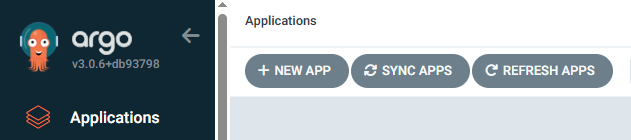
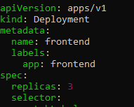
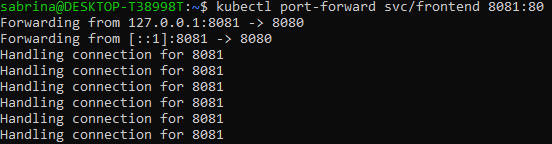
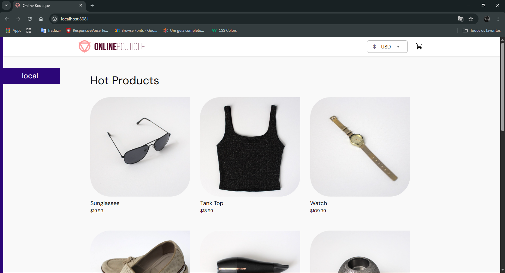

# 🚀 GitOps com ArgoCD e Kubernetes - Online Boutique

Este projeto é uma implementação prática de GitOps utilizando ArgoCD para realizar o deploy automatizado da aplicação, com um conjunto de microserviços, rodando em um cluster Kubernetes local com **Rancher Desktop**.

## Objetivos

- Implantar uma aplicação real composta por múltiplos microserviços no Kubernetes.
- Controlar o deploy e a configuração da aplicação por meio do Git (GitOps).
- Utilizar o ArgoCD para gerenciar o ciclo de vida da aplicação.
- (Opcional) Realizar customizações no manifesto da aplicação.

---

## Requisitos

- [x] Git e GitHub
- [x] Docker instalado
- [x] Rancher Desktop com Kubernetes habilitado
- [x] Kubectl configurado (`kubectl get nodes`)
- [x] ArgoCD instalado no cluster

---

## Estrutura do Repositório

microservices-demo/
├── gitops-microservices/
│   └── k8s/
│       └── online-boutique.yaml

---

## Tecnologias ultilizadas


**Kubernetes**: Orquestrador de contêineres para deploy, escalonamento e gerenciamento.


**ArgoCD**: Ferramenta GitOps para automação e sincronização de aplicações no K8s.


**GitHub**: Versionamento e repositório dos manifests (Infra como Código).


**Rancher Desktop**: Ambiente local para executar Kubernetes com suporte a kubectl.


**kubectlCLI**: Para interagir com o cluster Kubernetes.


**YAML**: Linguagem usada para descrever os recursos do Kubernetes.


**Linux (Ubuntu)**: Ambiente utilizado para rodar os comandos e interagir com o cluster.


---

## Etapas Realizadas

### 1. Fork e Organização do Repositório

- Fork do repositório original:  
  https://github.com/GoogleCloudPlatform/microservices-demo

- Criação de um novo repositório com o manifesto:  
  `gitops-microservices/k8s/online-boutique.yaml`

---

### 2. Instalação do ArgoCD no Cluster Local

```bash
kubectl create namespace argocd
kubectl apply -n argocd -f https://raw.githubusercontent.com/argoproj/argo-cd/stable/manifests/install.yaml
```
---

### 3. Acesso ao ArgoCD

Criar uma porta de acesso pro argo

```bash
kubectl port-forward svc/argocd-server -n argocd 8080:443
```

Para ter acesso ao argo no navegador

Acesse: https://localhost:8080

Para acessar o argo precisa de login

Usuário: admin

Senha: (precisa ver senha no terminal)


Coando para ver a senha de login do argo
```bash
kubectl -n argocd get secret argocd-initial-admin-secret -o jsonpath="{.data.password}" | base64 -d
```

---

### Criação do App no ArgoCD

- Vá em `applications`
    Em seguida clique em `+ new app`




***Configurção da aplicação***

- Nome: app-online

Cole seu repositório 
- Repositório Git: https://github.com/<seu-usuario>/microservices-demo.git

- Path: gitops-microservices/k8s

- Branch: main

- Cluster URL: https://kubernetes.default.svc

- Namespace: default

- Sincronização automática: ativada

Aplicação em execução no Argo e com sicronização automática


Os microserviços da aplicação


---

### 5. Verificação da Aplicação

Verifique os pods:

```bash
kubectl get pods
```

Verifique os serviços:

```bash
kubectl get svc
```

---

## 6. Adicionando mais replicas (extra)

Acesse o arquivo online-boutique.yaml no editor de texto nano

```bash
nano online-boutique.yaml
```

procura pelo kind deployment e name frontend

Adicione em spec 3 replicas





Enviei as alterações para o repositorio do github

```bash
git add .

git commit -m "descrição"

git push
```
---

### 7. Acessando o Frontend da Aplicação

Comando para fazer o port-forward, liberando a porta para aplicação rodar.

```bash
kubectl port-forward svc/frontend 8081:80
```

Após executar o comando a porta ja está liberada e podemos acessar a aplicção no navegador.



Acesse no navegador para ter acesso a aplicação.

http://localhost:8081


Aplicação da lojinha online botique rodando 100%





---


